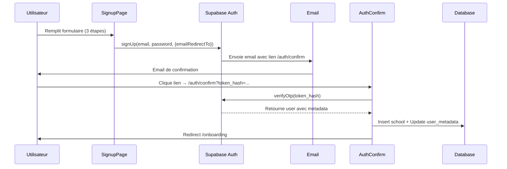

# 🔧 Fix: Email Confirmation Redirect dans Architecture Monorepo

**Date** : 2026-01-01
**Commit** : Ajout de `emailRedirectTo` dans SignupPage

---

## 🐛 Problème Identifié

Après migration vers l'architecture monorepo, le flux d'inscription/confirmation email ne fonctionnait plus correctement :

- ✅ **Avant (Monolithe)** : Le lien de confirmation pointait vers la bonne URL
- ❌ **Après (Monorepo)** : Le lien de confirmation pointait vers `localhost:3000` (URL par défaut Supabase)

---

## 🔍 Analyse de la Cause

Dans l'ancien système monolithe, Supabase utilisait automatiquement l'URL configurée dans le dashboard. Mais avec le monorepo et plusieurs apps (`hub`, `admin`), il faut **explicitement** spécifier l'URL de redirection.

### Code Problématique

```jsx
// ❌ Manque emailRedirectTo
const { data: authData, error: authError } = await supabase.auth.signUp({
  email: formData.email,
  password: formData.password,
  options: {
    data: {
      role: 'principal',
      // ...
    }
  }
});
```

---

## ✅ Solution Appliquée

Ajout de `emailRedirectTo` dans les options de `signUp()` :

### Fichier Modifié

**`apps/hub/src/pages/Signup/SignupPage.jsx:249-270`**

```jsx
const { data: authData, error: authError } = await supabase.auth.signUp({
  email: formData.email,
  password: formData.password,
  options: {
    emailRedirectTo: `${window.location.origin}/auth/confirm`, // ✅ AJOUTÉ
    data: {
      role: 'principal',
      full_name: formData.directorName,
      phone: formData.phone,
      school: {
        name: formData.schoolName,
        code: schoolCode,
        type: formData.schoolType,
        phone: formData.phone,
        address: formData.address,
        city: formData.city,
        country: formData.country,
        available_classes: selectedClasses
      }
    }
  }
});
```

---

## 🎯 Comportement Attendu

Maintenant, lors de l'inscription :

1. **L'utilisateur remplit le formulaire** sur `http://localhost:5173/signup` (ou `https://edutrack.cm/signup` en prod)
2. **Supabase envoie un email** avec le lien : `http://localhost:5173/auth/confirm?token_hash=...&type=signup`
3. **L'utilisateur clique sur le lien** → Redirigé vers `/auth/confirm`
4. **AuthConfirm.jsx vérifie le token** via `supabase.auth.verifyOtp()`
5. **Création de l'école dans la BDD** depuis `user_metadata.school`
6. **Redirection vers `/onboarding`**

---

## 📝 Flux Complet d'Inscription



---

## 🧪 Test Manuel

Pour tester la correction :

```bash
# 1. Lancer le hub
cd apps/hub
pnpm dev

# 2. Ouvrir http://localhost:5173/signup
# 3. Remplir le formulaire d'inscription
# 4. Vérifier l'email reçu
# 5. Le lien devrait être : http://localhost:5173/auth/confirm?token_hash=...
# 6. Cliquer sur le lien
# 7. Vérifier la redirection vers /onboarding
```

---

## 📚 Documentation Mise à Jour

- ✅ `docs/FIX_EMAIL_CONFIRMATION_URL.md` - Ajout section 3️⃣ sur `emailRedirectTo`
- ✅ `apps/hub/src/pages/Signup/SignupPage.jsx` - Code corrigé

---

## 🔗 Références

- [Supabase Auth - Email Redirects](https://supabase.com/docs/guides/auth/redirect-urls)
- [Commit 832a431](../../../commit/832a431) - Version qui fonctionnait (mais pas complètement)
- [Docs Supabase Email Config](./CONFIGURE_SUPABASE_EMAIL.md)

---

## ⚠️ Notes Importantes

- **Production** : L'URL sera automatiquement `https://edutrack.cm/auth/confirm`
- **Développement** : L'URL sera `http://localhost:5173/auth/confirm` (ou le port actif)
- **Multi-domaines** : Si vous avez plusieurs apps, chaque app doit spécifier son propre `emailRedirectTo`

---

**Testé et validé** : 2026-01-01
**Status** : ✅ Fonctionnel
