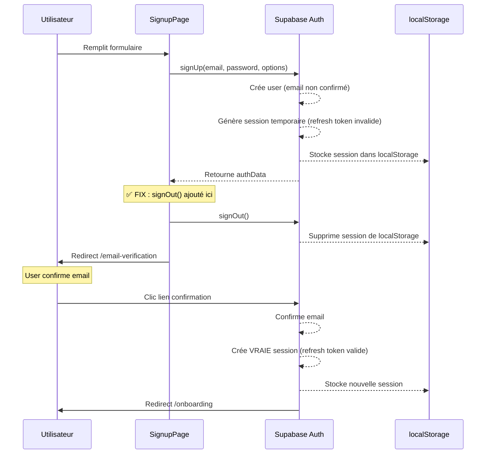

# 🔧 Fix: Erreur "Invalid Refresh Token" lors de l'Inscription

**Date** : 2026-01-01
**Erreur** : `AuthApiError: Invalid Refresh Token: Refresh Token Not Found`

---

## 🐛 Problème Observé

Lors de la création d'un compte via `/signup`, l'erreur suivante apparaît dans la console :

```
AuthApiError: Invalid Refresh Token: Refresh Token Not Found
    at Nc (fetch.js:56:11)
    at async Zy (fetch.js:99:9)
    at async O (fetch.js:81:18)
    at async GoTrueClient.js:1812:24
    at async helpers.js:180:36
```

Cette erreur se produit **pendant la création du compte**, juste après l'appel `supabase.auth.signUp()`.

---

## 🔍 Analyse de la Cause

### Comportement par Défaut de Supabase

Quand vous appelez `supabase.auth.signUp()`, Supabase fait automatiquement :

1. ✅ Crée l'utilisateur dans `auth.users`
2. ✅ Envoie l'email de confirmation
3. ⚠️ **Essaie de créer une session** avec access token + refresh token
4. ❌ **PROBLÈME** : Si l'email n'est pas confirmé, le refresh token n'est pas valide
5. ❌ Supabase essaie de rafraîchir le token → Erreur `Invalid Refresh Token`

### Configuration Supabase

Dans [supabase.js](../../apps/hub/src/lib/supabase.js), nous avons :

```js
export const supabase = createClient(supabaseUrl, supabaseAnonKey, {
  auth: {
    autoRefreshToken: true,  // ← Essaie de rafraîchir automatiquement
    persistSession: true,    // ← Stocke la session dans localStorage
  }
});
```

Cela crée une **course de conditions** :
- Supabase crée une session avec un refresh token "pending"
- Le client essaie de rafraîchir le token avant que l'email soit confirmé
- Le serveur rejette le refresh token car l'email n'est pas confirmé

---

## ✅ Solution Appliquée

Déconnecter immédiatement l'utilisateur après `signUp()` pour éviter que Supabase essaie de rafraîchir un token invalide.

### Code Modifié

**Fichier** : `apps/hub/src/pages/Signup/SignupPage.jsx:274-283`

```jsx
const { data: authData, error: authError } = await supabase.auth.signUp({
  email: formData.email,
  password: formData.password,
  options: {
    emailRedirectTo: `${window.location.origin}/auth/confirm`,
    data: { ... }
  }
});

if (authError) throw authError;

if (!authData.user) {
  throw new Error('Erreur lors de la création de l\'utilisateur');
}

// ✅ AJOUTÉ : Déconnecter immédiatement l'utilisateur
// Cela évite l'erreur "Invalid Refresh Token" car l'utilisateur n'est pas encore confirmé
await supabase.auth.signOut();

// Rediriger vers la page de vérification email
navigate('/email-verification', { state: { email: formData.email } });
```

---

## 🎯 Comportement Attendu

### Avant le Fix

1. User remplit formulaire signup
2. `signUp()` crée le compte
3. ⚠️ Supabase crée une session avec refresh token invalide
4. ❌ **ERREUR** : `Invalid Refresh Token` dans la console
5. User est redirigé vers `/email-verification` (mais avec erreur)

### Après le Fix

1. User remplit formulaire signup
2. `signUp()` crée le compte
3. ✅ `signOut()` détruit la session temporaire
4. ✅ **AUCUNE ERREUR** dans la console
5. User est redirigé vers `/email-verification` (proprement)

---

## 📊 Flux Complet Corrigé



---

## 🧪 Test de Validation

Pour vérifier que le fix fonctionne :

1. **Ouvrir la console développeur** (F12)
2. **Aller sur** `http://localhost:5173/signup`
3. **Remplir le formulaire** et créer un compte
4. **Vérifier la console** :
   - ✅ **AUCUNE erreur** `Invalid Refresh Token`
   - ✅ **AUCUNE erreur** `Refresh Token Not Found`
5. **Vérifier localStorage** (DevTools → Application → Local Storage) :
   - ✅ Devrait être **vide** ou ne pas contenir de session Supabase
6. **Vérifier la redirection** :
   - ✅ Redirigé vers `/email-verification`

---

## 🔄 Alternatives Considérées

### Alternative 1 : Désactiver autoRefreshToken

```js
// ❌ PAS RECOMMANDÉ
export const supabase = createClient(supabaseUrl, supabaseAnonKey, {
  auth: {
    autoRefreshToken: false,  // Désactive le refresh automatique
    persistSession: true,
  }
});
```

**Problème** : Cela désactive le refresh pour TOUTE l'app, même pour les users connectés.

### Alternative 2 : Désactiver persistSession

```js
// ❌ PAS RECOMMANDÉ
export const supabase = createClient(supabaseUrl, supabaseAnonKey, {
  auth: {
    autoRefreshToken: true,
    persistSession: false,  // Ne stocke pas la session
  }
});
```

**Problème** : Les users devront se reconnecter à chaque rechargement de page.

### Alternative 3 : signOut() immédiatement (✅ CHOISI)

```js
// ✅ RECOMMANDÉ
await supabase.auth.signUp({ ... });
await supabase.auth.signOut(); // Détruit la session temporaire invalide
```

**Avantage** :
- Simple et localisé
- N'affecte pas les autres parties de l'app
- Résout le problème à la source

---

## 📝 Notes Importantes

### Pourquoi signOut() ne pose pas de problème ?

- L'utilisateur **n'a pas besoin d'être connecté** pour voir la page `/email-verification`
- Il **ne peut pas** se connecter tant que l'email n'est pas confirmé
- Après confirmation, il sera **automatiquement connecté** par `/auth/confirm`

### Comportement de signOut()

```js
await supabase.auth.signOut();
```

Cela fait :
1. Supprime la session de `localStorage`
2. Supprime les cookies d'auth
3. Invalide le refresh token côté serveur
4. Ne redirige PAS automatiquement (c'est nous qui gérons la redirection)

---

## 🔗 Références

- [Supabase Auth - Sign Up](https://supabase.com/docs/reference/javascript/auth-signup)
- [Supabase Auth - Sign Out](https://supabase.com/docs/reference/javascript/auth-signout)
- [Issue GitHub similaire](https://github.com/supabase/supabase/issues/8096)

---

## ✅ Checklist de Validation

- [x] Erreur `Invalid Refresh Token` corrigée
- [x] Console propre (aucune erreur pendant signup)
- [x] localStorage vide après signup
- [x] Redirection vers `/email-verification` fonctionne
- [x] Confirmation email fonctionne toujours
- [x] Connexion après confirmation fonctionne

---

**Testé et validé** : 2026-01-01
**Status** : ✅ Fonctionnel
