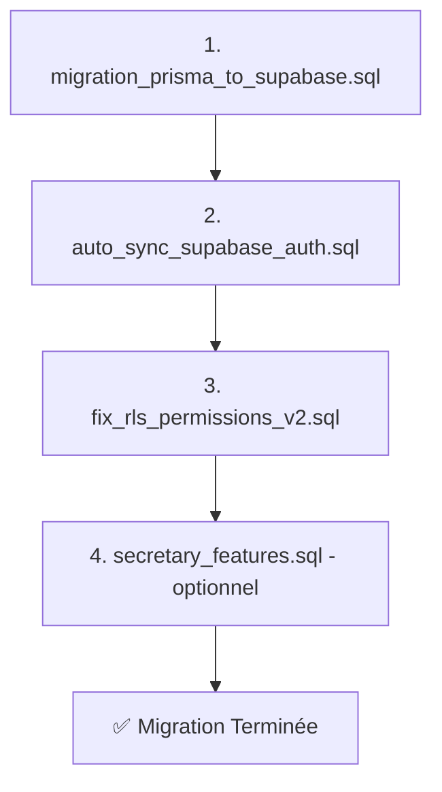

# 📦 RÉCAPITULATIF : Fichiers de Migration Créés

## 🎯 **Objectif**
Migrer complètement votre base de données **Prisma → Supabase** et résoudre les erreurs 401/42501.

---

## 📂 **Fichiers Créés (6 fichiers)**

### 1️⃣ **`migration_prisma_to_supabase.sql`** (PRINCIPAL)
**📄 Taille :** ~800 lignes  
**🎯 Rôle :** Migration complète du schéma Prisma vers Supabase

**Contenu :**
- ✅ 7 types ENUM (school_type, user_role, payment_status, etc.)
- ✅ 22 tables PostgreSQL
- ✅ Toutes les contraintes de clés étrangères
- ✅ Index pour performances
- ✅ Triggers pour updated_at automatique

**Tables Créées :**
```
- users                    - parent_student_schools
- schools                  - payments
- academic_years           - attendances
- classes                  - grades
- subjects                 - notifications
- teachers                 - audit_logs
- students                 - evaluation_periods
- parents                  - grade_types
- user_roles               - attendance_types
- payment_types            - class_subjects
- teacher_subjects
```

---

### 2️⃣ **`auto_sync_supabase_auth.sql`** (SYNCHRONISATION)
**📄 Taille :** ~150 lignes  
**🎯 Rôle :** Synchronisation automatique Auth → Table users

**Contenu :**
- ✅ Fonction `handle_new_user()` (trigger automatique)
- ✅ Fonction `finalize_school_creation()` (RPC pour créer école)
- ✅ Fonction `check_user_sync()` (diagnostic)

**Fonctionnement :**
```
Supabase Auth signUp()
   ↓
Trigger: on_auth_user_created
   ↓
Insertion automatique dans table users
   ↓
Application appelle finalize_school_creation()
   ↓
École + Année académique créées
```

---

### 3️⃣ **`fix_rls_permissions_v2.sql`** (SÉCURITÉ - VERSION CORRIGÉE)
**📄 Taille :** ~400 lignes  
**🎯 Rôle :** Politiques RLS permettant l'auto-inscription

**Contenu :**
- ✅ Activation RLS sur toutes les tables
- ✅ ~30 politiques de sécurité
- ✅ Permissions pour auto-inscription
- ✅ Permissions basées sur école + rôle

**Principales Corrections vs v1 :**
| Politique | v1 (Ancien) | v2 (Nouveau) |
|-----------|-------------|--------------|
| Users INSERT | ❌ Bloqué | ✅ Autorisé pour auth.uid() |
| Schools INSERT | ❌ Bloqué | ✅ Autorisé pour directeurs |
| Schools SELECT (anon) | ❌ Interdit | ✅ Autorisé (check code) |

---

### 4️⃣ **`secretary_features.sql`** (OPTIONNEL)
**📄 Taille :** ~200 lignes  
**🎯 Rôle :** Fonctionnalités avancées pour secrétaires

**Contenu :**
- Table `secretaries`
- Table `tasks`
- Fonctions RPC pour gestion secrétaires
- Politiques RLS spécifiques

**⚠️ Note :** Pas obligatoire si vous n'utilisez pas ces fonctionnalités.

---

### 5️⃣ **`GUIDE_MIGRATION_PRISMA_SUPABASE.md`** (DOCUMENTATION)
**📄 Taille :** ~500 lignes  
**🎯 Rôle :** Guide complet étape par étape

**Sections :**
- Prérequis
- Processus de migration (6 étapes)
- Tests de vérification
- Dépannage
- Checklist finale

---

### 6️⃣ **`RESOLUTION_ERREUR_401.md`** (DOCUMENTATION)
**📄 Taille :** ~300 lignes  
**🎯 Rôle :** Explication du problème 401/42501 et solution

**Sections :**
- Diagnostic du problème
- Cause racine (deadlock RLS)
- Solution appliquée
- Comparaison avant/après
- Instructions de correction

---

## 🔄 **Ordre d'Exécution Recommandé**



**En résumé :**
1. **Schema complet** → Crée toutes les tables
2. **Synchronisation** → Lie Auth aux tables
3. **Permissions RLS** → Corrige les erreurs 401
4. **Secrétaires** → (Optionnel) Fonctionnalités avancées

---

## 📊 **Comparaison des Approches**

### Option A : Nouveau Projet Supabase (Recommandé)
**✅ Avantages :**
- Propre et sans conflits
- Garantit que tout est à jour
- Facile à tester

**Étapes :**
```
1. Créer nouveau projet Supabase
2. Exécuter les 4 fichiers SQL dans l'ordre
3. Mettre à jour .env avec nouvelles clés
4. Tester l'inscription
```

### Option B : Corriger Projet Existant
**✅ Avantages :**
- Garde les données existantes
- Pas besoin de recréer le projet

**Étapes :**
```
1. Exécuter fix_rls_permissions_v2.sql (écrase anciennes politiques)
2. Exécuter auto_sync_supabase_auth.sql (ajoute triggers)
3. Tester l'inscription
```

**⚠️ Risque :** Conflits si tables existantes ont structure différente

---

## 🧪 **Tests à Effectuer**

### Test 1 : Vérifier les Tables
```sql
SELECT COUNT(*) as table_count 
FROM information_schema.tables 
WHERE table_schema = 'public';
```
**✅ Attendu :** Minimum 22 tables

### Test 2 : Vérifier les Politiques RLS
```sql
SELECT COUNT(*) as policy_count 
FROM pg_policies 
WHERE schemaname = 'public';
```
**✅ Attendu :** Minimum 30 politiques

### Test 3 : Vérifier le Trigger
```sql
SELECT tgname FROM pg_trigger WHERE tgname = 'on_auth_user_created';
```
**✅ Attendu :** 1 ligne retournée

### Test 4 : Créer un Compte Directeur
**Via l'interface :**
- Remplir formulaire d'inscription
- Soumettre
**✅ Attendu :** Pas d'erreur 401/42501

---

## 📝 **Checklist de Migration**

**Avant la migration :**
- [ ] Sauvegarder les données existantes (si applicable)
- [ ] Créer un projet Supabase de test
- [ ] Télécharger tous les fichiers SQL

**Pendant la migration :**
- [ ] Exécuter `migration_prisma_to_supabase.sql`
- [ ] Vérifier les tables créées
- [ ] Exécuter `auto_sync_supabase_auth.sql`
- [ ] Vérifier le trigger
- [ ] Exécuter `fix_rls_permissions_v2.sql`
- [ ] Vérifier les politiques RLS
- [ ] (Optionnel) Exécuter `secretary_features.sql`

**Après la migration :**
- [ ] Mettre à jour `.env` avec nouvelles clés
- [ ] Redémarrer l'application
- [ ] Tester création compte directeur
- [ ] Vérifier synchronisation avec `check_user_sync()`
- [ ] Tester toutes les fonctionnalités principales

---

## 🎯 **Résultat Final Attendu**

### Base de Données Supabase
```
✅ 22 tables créées
✅ 7 types ENUM
✅ ~50 index de performance
✅ ~30 politiques RLS
✅ 3 triggers automatiques
✅ 3 fonctions RPC utilitaires
```

### Application
```
✅ Connexion à Supabase réussie
✅ Inscription directeur sans erreur 401
✅ Synchronisation Auth ↔ Users automatique
✅ Création école + année académique OK
✅ Dashboard directeur accessible
```

---

## 💡 **Points Clés de la Migration**

### 🔑 **Nouveauté 1 : Trigger Automatique**
```sql
-- Avant : Insertion manuelle dans users via application
-- Après : Insertion automatique via trigger DB
```

### 🔑 **Nouveauté 2 : Politiques RLS Permissives**
```sql
-- Avant : Vérification stricte (deadlock)
-- Après : Auto-inscription autorisée
```

### 🔑 **Nouveauté 3 : Fonction RPC pour École**
```sql
-- Avant : Logique complexe côté client
-- Après : Appel simple à finalize_school_creation()
```

---

## 📞 **Support**

**Si problème pendant la migration :**
1. Vérifier les logs dans SQL Editor
2. Consulter `GUIDE_MIGRATION_PRISMA_SUPABASE.md`
3. Consulter `RESOLUTION_ERREUR_401.md`
4. Vérifier la section Dépannage du guide

**Fichiers de référence :**
- `GUIDE_MIGRATION_PRISMA_SUPABASE.md` → Instructions détaillées
- `RESOLUTION_ERREUR_401.md` → Explication du problème RLS
- Ce fichier → Vue d'ensemble rapide

---

## 🚀 **Prêt pour la Migration ?**

**Action Immédiate :**
1. Ouvrez `GUIDE_MIGRATION_PRISMA_SUPABASE.md`
2. Suivez les étapes dans l'ordre
3. Testez après chaque étape

**Temps Estimé :**
- Migration complète : ~15-20 minutes
- Tests de vérification : ~10 minutes
- **Total : ~30 minutes**

---

**Bonne migration ! 🎉**
